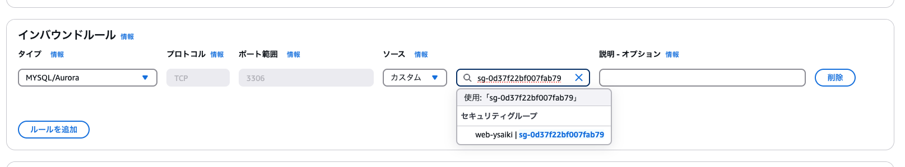
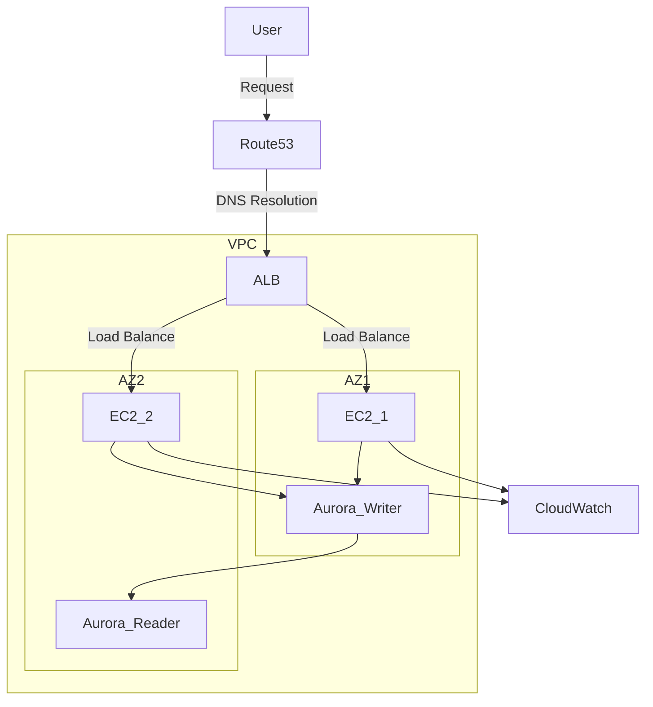
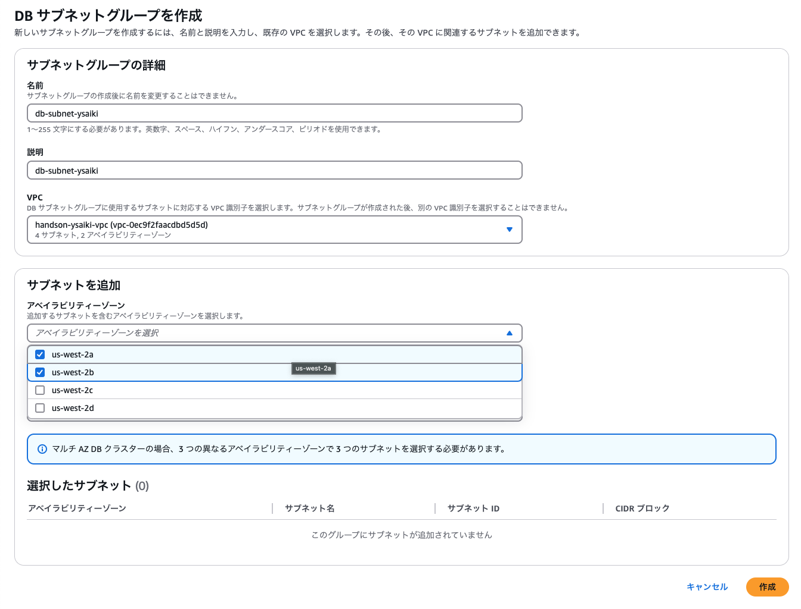

---
title: "AWS JumpStart 2025の1日目に参加した時のメモ"
date: 2025-03-13T09:10:00+09:00
draft: false
tags: ["AWS"]
--- 
# AWS JumpStart 2025の1日目に参加した時のメモ

## イベント概要
- 日時: 2025年3月13日(木) - 3月14日(金)
- 公式リンク: https://aws.amazon.com/jp/blogs/news/aws-jumpstart-2025/

## 1日目午前

### プロトタイプフェーズ(100人以下)のシステムの場合

```.mermaid
graph TD
    User -- Request--> Route53
    Route53 -- DNS Resolution --> ElasticIP
    subgraph VPC [AWS VPC]
        ElasticIP --> EC2
        EC2 -->| RDS
        RDS -->| EC2
        EC2 --> ElasticIP
    end
```

**主要コンポーネント:**
- **Route 53**: AWSのDNSサービス。ドメイン名をIPアドレスに変換する役割を担います。
- **Elastic IP**: 固定IPアドレスを提供するサービス。EC2インスタンスが再起動しても同じIPアドレスを維持できます。
- **EC2**: 仮想サーバーインスタンスを提供するサービス。アプリケーションを実行します。
- **RDS**: リレーショナルデータベースサービス。データの永続化を担当します。

**このフェーズの特徴:**
- シンプルな構成で迅速に開発・デプロイが可能
- 少ないリソースで運用可能
- 単一障害点が存在するため、高可用性は限定的
- 水平スケーリングの仕組みがない

## VPCについて

### VPCとは
VPC (Virtual Private Cloud) は、AWS上で独自の仮想ネットワークを作成するサービスです。オンプレミスのネットワーク環境と同様の制御が可能で、セキュリティやネットワークの設定を細かく管理できます。

### サブネットの概念
- **サブネット**: VPC内のIPアドレス範囲を区切る単位
- **パブリックサブネット**: インターネットへの直接アクセスが可能なサブネット
- **プライベートサブネット**: インターネットから直接アクセスできないサブネット

### VPCにおけるセキュリティ制御
- **NACL (Network Access Control List)**:
  - サブネットレベルでのセキュリティコントロール
  - ステートレス（往路と復路のトラフィックをそれぞれ設定する必要がある）
  - 許可と拒否の両方のルールを設定可能
  - 番号付きルールリストで優先順位を管理

- **セキュリティグループ (Security Group)**:
  - インスタンスレベルでのセキュリティコントロール
  - ステートフル（往路のトラフィックを許可すると復路も自動的に許可）
  - 許可ルールのみ設定可能（明示的な拒否はできない）
  - 同じセキュリティグループ内のインスタンス間の通信を簡単に許可可能


セキュリティグループをインバウンドのソースとして指定可能

### VPCエンドポイント
VPCエンドポイントを使用すると、インターネットゲートウェイやNATゲートウェイを経由せずにAWSサービス（S3、DynamoDBなど）に接続できます。これにより、トラフィックがAWSネットワーク内に留まり、セキュリティが向上します。

- **ゲートウェイエンドポイント**: S3やDynamoDBへのアクセスに使用
- **インターフェイスエンドポイント**: 他のAWSサービスへのアクセスに使用

## EC2について

### EC2インスタンスの基本概念
- **AMI (Amazon Machine Image)**: EC2インスタンスの構成情報を含むテンプレート
- **インスタンスタイプ**: 使用するCPU、メモリ、ストレージ、ネットワーク性能の組み合わせ
- **EBS (Elastic Block Store)**: EC2インスタンスに接続できる永続的なストレージボリューム

### インスタンスタイプの選択
用途に応じて適切なインスタンスタイプを選択することが重要です：
- **汎用（T3, M5など）**: バランスの取れたコンピューティング、メモリ、ネットワーク性能
- **コンピューティング最適化（C5など）**: 高性能なCPUが必要なワークロード
- **メモリ最適化（R5など）**: 大規模なデータセットを処理するアプリケーション
- **ストレージ最適化（I3, D2など）**: 高いI/O性能が必要なワークロード
- **高速コンピューティング（P3, G4など）**: GPUを使用した機械学習やグラフィック処理

### EC2インスタンスの管理
- **起動**: インスタンスの作成と開始
- **停止**: インスタンスをシャットダウン（データは保持）
- **再起動**: インスタンスを再起動
- **終了**: インスタンスを完全に削除（データは削除）

### Session Managerの活用
AWS Systems Manager Session Managerを使用すると、インバウンドポートを開放せずにEC2インスタンスに安全に接続できます。

**メリット:**
- SSHポート（22番）を開放する必要がない
- キーペアの管理が不要
- 接続ログを CloudTrail や CloudWatch Logs に記録可能
- 接続時の認証にIAMポリシーを使用可能


## 1日目午前

### 10,000人規模のフェーズのシステムの場合
ユーザー数が増加すると、単一のEC2インスタンスだけでは対応できなくなります。より堅牢なアーキテクチャが必要になります。



**主要コンポーネント:**
- **ALB (Application Load Balancer)**: HTTP/HTTPSトラフィックを複数のEC2インスタンスに分散
- **マルチAZ構成**: 複数のアベイラビリティゾーンにリソースを分散配置
- **Amazon Aurora**: 高性能で可用性の高いRDBMS
- **CloudWatch**: モニタリングとアラート機能

### リージョンとアベイラビリティゾーン（AZ）
- **リージョン**: 地理的に分かれたAWSのデータセンター群（東京、シドニー、バージニアなど）
- **アベイラビリティゾーン (AZ)**: 各リージョン内の独立したデータセンター
  - 物理的に分離されているため、災害などの影響を局所化
  - 低レイテンシーの高速ネットワークで接続されている
  - 最低でも2つのAZを使用することで高可用性を確保

### ALBの構成要素
- **ロードバランサー**: トラフィックの入り口となるエンドポイント
- **リスナー**: 特定のポートとプロトコルでリクエストを受け付け
- **ルール**: リクエストをどのターゲットグループに転送するかを決定
- **ターゲットグループ**: EC2インスタンスやコンテナなどのターゲットの集合

### Amazon Aurora
Amazon Auroraは、MySQLおよびPostgreSQLと互換性のある高性能かつ高可用性のリレーショナルデータベースです。

**特徴:**
- 標準のMySQLに比べて最大5倍、PostgreSQLに比べて最大3倍の性能
- 自動的にストレージを拡張（最大128TB）
- 最大15のリードレプリカをサポート
- 連続的なバックアップとポイントインタイムリカバリ
- マルチAZデプロイメントによる高可用性

### Auroraの構成要素
- **DBクラスター**: Auroraのデータベース環境全体
- **プライマリインスタンス**: 読み取りと書き込みの両方をサポートするインスタンス
- **リードレプリカ**: 読み取り専用のインスタンス（スケーラビリティと可用性の向上）
- **クラスターエンドポイント**: プライマリインスタンスに接続するためのエンドポイント
- **リーダーエンドポイント**: リードレプリカに接続するためのエンドポイント

### DBサブネットグループ
Aurora DBクラスターを作成する際は、少なくとも2つのアベイラビリティゾーンにまたがるサブネットグループを指定する必要があります。これにより、高可用性を確保します。



## コンテナ環境の構築

### Amazon ECS (Elastic Container Service)
AmazonECSは、コンテナ化されたアプリケーションを簡単に実行・管理できるフルマネージドコンテナオーケストレーションサービスです。

**ECSの主要コンポーネント:**
- **クラスター**: コンテナを実行するための論理的なグループ
- **タスク定義**: コンテナの設定（イメージ、CPUやメモリの割り当て、ポートマッピングなど）
- **タスク**: タスク定義のインスタンス（実行中のコンテナ）
- **サービス**: タスクの実行と維持を管理

### AWS Fargate
Fargateは、ECSやEKSのコンテナをサーバーレスで実行するためのコンピューティングエンジンです。

**Fargateの特徴:**
- EC2インスタンスの管理が不要
- コンテナごとに正確なリソース指定が可能
- 使用したリソースに対してのみ課金
- VPCと統合されたセキュリティ

**統合のメリット:**
- コンテナの動的な追加・削除をALBが自動的に検出
- ヘルスチェックによる異常なコンテナの自動検出と除外
- パスベースルーティングによる複数のサービスへのトラフィック分散

### 100万人以上の規模のフェーズのシステムの場合
さらに規模が拡大した場合、より高度なアーキテクチャが必要になります。

1. **静的コンテンツのオフロード**
   - CloudFront + S3を使用して静的コンテンツを高速配信
   - オリジンサーバーの負荷軽減とレイテンシーの低減

2. **読み取り負荷の分散**
   - Auroraリードレプリカの追加
   - ElastiCacheを使用したインメモリキャッシュの導入

3. **Auto Scaling**
   - 需要に応じてEC2インスタンスを自動的に増減
   - ターゲット追跡スケーリングポリシーの活用

4. **マイクロサービスアーキテクチャ**
   - 機能ごとに独立したサービスに分割
   - APIゲートウェイを使用したサービス間の通信管理
