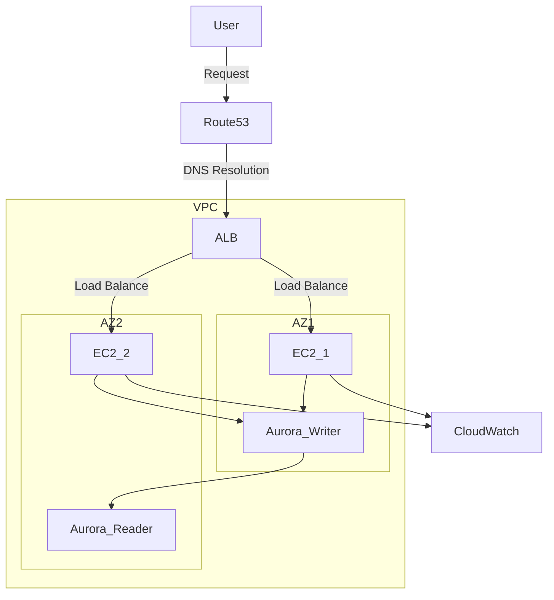

<!--more-->

## Event Overview

- Date: March 13 (Thu) - March 14 (Fri), 2025
- Official link: https://aws.amazon.com/jp/blogs/news/aws-jumpstart-2025/

## Day 1 Morning

### System for the Prototype Phase (Under 100 Users)

```.mermaid
graph TD
    User -- Request--> Route53
    Route53 -- DNS Resolution --> ElasticIP
    subgraph VPC [AWS VPC]
        ElasticIP --> EC2
        EC2 -->| RDS
        RDS -->| EC2
        EC2 --> ElasticIP
    end
```

**Key Components:**

- **Route 53**: AWS DNS service. Responsible for converting domain names to IP addresses.
- **Elastic IP**: A service providing static IP addresses. Allows EC2 instances to maintain the same IP address after restarts.
- **EC2**: A service providing virtual server instances. Runs applications.
- **RDS**: Relational Database Service. Handles data persistence.

**Characteristics of this phase:**

- Simple architecture enabling rapid development and deployment
- Can be operated with minimal resources
- Single points of failure exist, limiting high availability
- No horizontal scaling mechanism

## About VPC

### What is VPC?

VPC (Virtual Private Cloud) is a service for creating your own virtual network on AWS. It provides the same level of control as an on-premises network environment, allowing fine-grained management of security and network settings.

### Subnet Concepts

- **Subnet**: A unit that partitions IP address ranges within a VPC
- **Public Subnet**: A subnet with direct internet access
- **Private Subnet**: A subnet not directly accessible from the internet

### Security Controls in VPC

- **NACL (Network Access Control List)**:
  - Subnet-level security control
  - Stateless (inbound and outbound traffic must each be configured separately)
  - Both allow and deny rules can be set
  - Numbered rule list for priority management

- **Security Group**:
  - Instance-level security control
  - Stateful (allowing inbound traffic automatically allows return traffic)
  - Only allow rules can be set (no explicit deny)
  - Easy to allow communication between instances in the same security group


A security group can be specified as an inbound source

### VPC Endpoints

VPC endpoints allow connections to AWS services (S3, DynamoDB, etc.) without going through an internet gateway or NAT gateway. This keeps traffic within the AWS network, improving security.

- **Gateway Endpoint**: Used for access to S3 and DynamoDB
- **Interface Endpoint**: Used for access to other AWS services

## About EC2

### Basic EC2 Instance Concepts

- **AMI (Amazon Machine Image)**: A template containing the configuration information for an EC2 instance
- **Instance Type**: A combination of CPU, memory, storage, and network performance
- **EBS (Elastic Block Store)**: Persistent storage volumes attachable to EC2 instances

### Choosing an Instance Type

Selecting the appropriate instance type based on the use case is important:

- **General Purpose (T3, M5, etc.)**: Balanced compute, memory, and network performance
- **Compute Optimized (C5, etc.)**: Workloads requiring high-performance CPUs
- **Memory Optimized (R5, etc.)**: Applications processing large datasets
- **Storage Optimized (I3, D2, etc.)**: Workloads requiring high I/O performance
- **Accelerated Computing (P3, G4, etc.)**: Machine learning and graphics processing using GPUs

### Managing EC2 Instances

- **Launch**: Create and start an instance
- **Stop**: Shut down an instance (data is retained)
- **Reboot**: Restart an instance
- **Terminate**: Permanently delete an instance (data is deleted)

### Using Session Manager

AWS Systems Manager Session Manager allows you to securely connect to EC2 instances without opening inbound ports.

**Benefits:**

- No need to open SSH port (22)
- No key pair management required
- Connection logs can be recorded in CloudTrail and CloudWatch Logs
- IAM policies can be used for connection authentication

## Day 1 Morning

### System for the 10,000-User Phase

As the number of users increases, a single EC2 instance can no longer handle the load. A more robust architecture is needed.



**Key Components:**

- **ALB (Application Load Balancer)**: Distributes HTTP/HTTPS traffic across multiple EC2 instances
- **Multi-AZ Configuration**: Resources distributed across multiple Availability Zones
- **Amazon Aurora**: High-performance, highly available RDBMS
- **CloudWatch**: Monitoring and alerting

### Regions and Availability Zones (AZ)

- **Region**: Geographically separated groups of AWS data centers (Tokyo, Sydney, Virginia, etc.)
- **Availability Zone (AZ)**: Independent data centers within each region
  - Physically separated to localize the impact of disasters
  - Connected by low-latency, high-speed networks
  - Using at least 2 AZs ensures high availability

### ALB Components

- **Load Balancer**: The endpoint serving as the entry point for traffic
- **Listener**: Accepts requests on specific ports and protocols
- **Rules**: Determine which target group to forward requests to
- **Target Group**: A collection of targets such as EC2 instances or containers

### Amazon Aurora

Amazon Aurora is a high-performance, highly available relational database compatible with MySQL and PostgreSQL.

**Features:**

- Up to 5x faster than standard MySQL and 3x faster than PostgreSQL
- Automatic storage expansion (up to 128TB)
- Supports up to 15 read replicas
- Continuous backup and point-in-time recovery
- High availability through Multi-AZ deployment

### Aurora Components

- **DB Cluster**: The entire Aurora database environment
- **Primary Instance**: An instance supporting both reads and writes
- **Read Replica**: Read-only instances (for improved scalability and availability)
- **Cluster Endpoint**: Endpoint for connecting to the primary instance
- **Reader Endpoint**: Endpoint for connecting to read replicas

### DB Subnet Group

When creating an Aurora DB cluster, you must specify a subnet group spanning at least 2 Availability Zones to ensure high availability.


## Building Container Environments

### Amazon ECS (Elastic Container Service)

Amazon ECS is a fully managed container orchestration service that makes it easy to run and manage containerized applications.

**ECS Key Components:**

- **Cluster**: A logical group for running containers
- **Task Definition**: Container configuration (image, CPU/memory allocation, port mapping, etc.)
- **Task**: An instance of a task definition (a running container)
- **Service**: Manages task execution and maintenance

### AWS Fargate

Fargate is a compute engine for running ECS or EKS containers in a serverless manner.

**Fargate Features:**

- No EC2 instance management required
- Precise resource specification per container
- Pay only for resources used
- Security integrated with VPC

**Integration Benefits:**

- ALB automatically detects dynamic addition/removal of containers
- Automatic detection and exclusion of unhealthy containers through health checks
- Traffic distribution across multiple services via path-based routing

### System for the 1 Million+ Users Phase

For even larger scale, more advanced architecture is needed.

1. **Static Content Offloading**
   - High-speed delivery of static content using CloudFront + S3
   - Reduced origin server load and latency

2. **Read Load Distribution**
   - Adding Aurora read replicas
   - Introducing in-memory caching with ElastiCache

3. **Auto Scaling**
   - Automatically increase/decrease EC2 instances based on demand
   - Leveraging target tracking scaling policies

4. **Microservices Architecture**
   - Splitting into independent services by function
   - Managing inter-service communication using API Gateway
